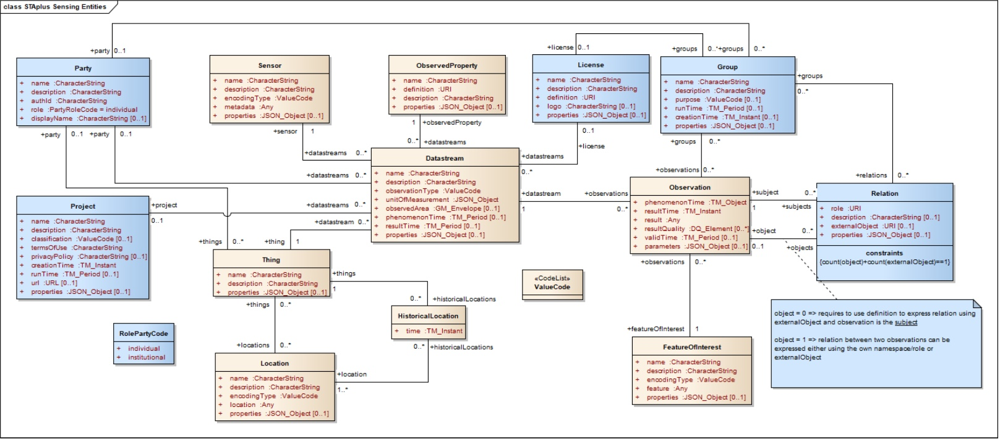

# GISer's Weekly Issue 144, 2022-07-01

## GeoSpatial

1. [OGC best practices for using SensorThings API with citizen science]()

The STAplus introduces three features: ownership, license and group.

The first part of the STAplus extension offers to operate an existing deployment with the concept of ownership: A STAplus deployment enables authenticated users to manage their objects (things, sensors, observations, etc.).

By associating licenses with their contributions (sensor readings made available as observations), it is possible to ensure proper re-use.

The second important innovation that STAplus offers is the ability to make relationships between observations explicit. The Relation concept of the extensions allows the implementation of performant convenience API functions that support semantic queries.

Third and finally, the Group concept of STAplus enables the creation of bags or sets by creating collections of observations via linking or deep copy. This

2. [OpenChirp](https://openchirp.io/)

OpenChirp, an Open Source Platform for IoT with support for LoRaWAN, is built upon LoRaWAN with the user management framework, application programming interfaces (APIs), and core services. In particular, OpenChirp is currently powering a hosted campus network, enabling users to spawn stand-alone instances with various services concerning device registration, data serialization and storage, and web access.

3. [Fit IoT Lab](https://www.iot-lab.info/)

FIT IoT-LAB is a very large-scale IoT Testbed. It provides a facility suitable for testing networking with small wireless sensor devices and heterogeneous communicating objects.

4. [ChirpBox](https://chirpbox.github.io/)

ChirpBox is an infrastructure-less LoRa Testbed solution featuring firmware dissemination and log trace, which is recommended to be deployed in remote areas without communication and power conditions.

## Tool

1. [CodeTour](https://marketplace.visualstudio.com/items?itemName=vsls-contrib.codetour)

CodeTour is a VS Code extension to record and play guided walkthroughs for your codebase.

The purpose of the tours is mainly to ease developers' onboarding on a project. When you start a tour, you're redirected step by step to their associated code snippets along with the comment.

2. [React Arborist](https://github.com/brimdata/react-arborist)

A sortable, virtual, customizable tree component for React.

3. [Sigma.js](https://github.com/jacomyal/sigma.js)

Sigma.js is an open-source JavaScript library that visualizes graphs of thousands of nodes and edges.

## Resources

1. [9 Boss Uncommon Tricks](https://twitter.com/girdley/status/1524009155245182976)

The author shared several good bosses' unique tricks based on over 25 years and 1,000s employees.

2. [Decentralized Applications Architecture: Back End, Security and Design Patterns](https://www.freecodecamp.org/news/how-to-design-a-secure-backend-for-your-decentralized-application-9541b5d8bddb/)

This article covers several main principles of properly designing and implementing back-end and smart contracts for decentralized applications, taking Ethereum as a primary example. However, much of it would apply to EOS, Tron and other decentralized data platforms.

3. [The Complete Guide to Full Stack Ethereum Development](https://www.freecodecamp.org/news/full-stack-ethereum-development/)

In this article, you'll learn how to build full-stack dApps with React, Ethers.js, Solidity, and Hardhat.

You can find the code for this project [here](https://github.com/dabit3/full-stack-ethereum). The video course for this tutorial is [here](https://www.youtube.com/watch?v=a0osIaAOFSE).

4. [Creating Node.js Docker images that build in 2 seconds](https://xmorse.xyz/blog/creating-node-js-docker-images-that-build-in-2-seconds-c428aec57fd44a9f93957bdf2ebf4f54)

- Install dependencies outside of Docker
- Bundle your code in one file
- Copy your bundled code together with eventually needed artifacts inside Docker
- Skipping unnecessary native dependencies

5. [Monorepos in JavaScript & TypeScript](https://www.robinwieruch.de/javascript-monorepos/?ck_subscriber_id=1664454795)

This is a comprehensive tutorial on Monorepos in JavaScript/TypeScript --- which uses state-of-the-art tools for this kind of architecture in frontend applications.

6. [How To Take Smart Notes](https://fortelabs.co/blog/how-to-take-smart-notes/)

The author shares ten principles to revolutionize your note-taking and writing he learned from the book [How To Take Smart Notes]

`Instead of squeezing as many pages as possible out of one idea, How To Take Smart Notes squeezes as many ideas as possible onto every page.`

Related

- [How to Take Smart Notes Summary](https://fourminutebooks.com/how-to-take-smart-notes-summary/)
- [How to Take Smart Notes (Sönke Ahrens) - Book Summary and Notes](https://aliabdaal.com/book-notes/how-to-take-smart-notes/)

7. [Feedback Decision Tree](https://hbr.org/2022/06/the-right-way-to-process-feedback)

A method to make your decision-making process consistent and structured.

Take your time to conduct the reflective process, such as checking whether the feedback aligns with your values and professional goals.

The result should be that you feel confident in how you will move forward with the feedback you received.

## Comments

1. Prioritization is a political problem as much as an analytical problem.
   --[Richard Mironov](https://www.mironov.com/pri-politics/)

2. The great thing about working in tech is that there are always new problems to solve, new markets to create, and new products to ship. The macro events don't change that. So focus yourself and your team on building and shipping those things, get some wins, and move forward with optimism and positive energy. It will be infectious.
   --[Staying Positive](https://avc.com/2022/06/staying-positive-2/)

3. The difference between great and bad projects is not headcount – it's leadership. It's easy to mix the two because great projects tend to have more headcount. But that's only true because these projects were going well, and the company decided to double down on them.
   --[Three Myths of Headcount](https://twitter.com/pedroh96/status/1535361608431591427)

4. If you're a leader who is scared of the changes that remote work will bring, I challenge you to make the necessary cultural shifts, adjust your organization's workflows, and overcome the biggest remote workplace barrier: yourself.
   --[Remote Work Is Just Work'](https://fortune.com/2022/06/21/gitlab-ceo-remote-work-just-work-careers-success-leadership-pandemic-sid-sijbrandij/)

## Review

- [The week of 2021(Issue-93)](https://github.com/lkcozy/weekly/blob/master/docs/2021/issue-93.md)
- [The week of 2020(Issue-44)](https://github.com/lkcozy/weekly/blob/master/docs/2020/issue-44.md)
