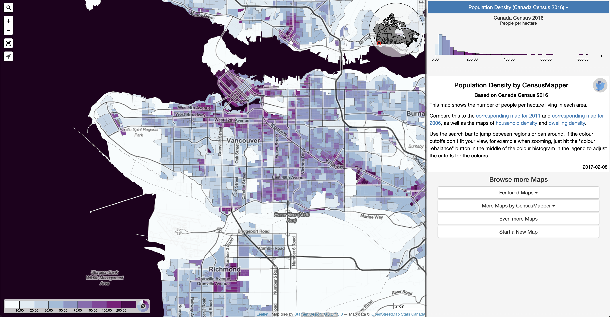

# GeoSpatial

1. [Mapbox Data Explorer](https://labs.mapbox.com/labs/mbxdataexplorer/)

Mapbox Data Explorer is a new tool help developers preview their data before processing and uploading it. Using the Data Explorer, developers can brainstorm potential stories and reveals patterns, with littler data preparation. With the Data Explorer, visualizing large datasets is as simple as drag and drop. You start with an empty map, and after you drop the file you can chose which property you'd like to colorize.

2. [Inddorway](https://www.indoorway.com/)

Indoorway allows users to monitor and understand the movement of mobile assets such as forklifts, tugger trains, workers, or WIP – with great accuracy and in real time. Its Real-Time Location System (RTLS) uses Ultra-Wideband (UWB) technology, which ensures very high accuracy (<1m) and reliability in industrial facilities. Indoorway turns the asset location and movement data into actionable insights so users can make informed decisions to improve efficiency of processes, asset utilization and reduce waste.

3. [Canadian Elections Fun](https://doodles.mountainmath.ca/blog/2019/10/22/elections-fun/)

This map makes it virtually impossible to get a good reading of the distribution of votes. There are a couple of ways around this.

For example, one could break out the areas with electoral districts too small to make a visible impact on the map, or use a cartogram, like the following two examples taken from the Wikipedia page of the 2019 federal election.

The first keeps the overall geographic context, although the metropolitan areas that are broken out are hard to interpret unless one if very familiar with each region. The cartogram distorts the areas to give each electoral district the same amopunt of space, and thus gives a proportional view of the number of seats each party won. In this version, the labels and breaks help delineate familiar geographies, but it can be hard to properly place them on a map.

To bridge the divide between overall geography and emphasis on treating each district separately, one can also animate the cartogram between the familiar map view and the cartogram view. In the following example that we built as an observable notebook we move between a map of Canada and a cartogram where each electoral district is a dot with size given by the total number of votes cast.

4. [CensusMapper](https://censusmapper.ca/)

CensusMapper offers several services based around census Canada data. With CensusMapper you can:

- create interactive Canada-wide custom maps based on census data across all census aggregation levels,
- explore census variables for specific geographies,
- explore census data by mapping user-defined functions based on Census variables,
- download census variables through our map-based interface,
- enrich your own datasets with census Canada data.

5. [CITY DENSITY PATTERNS](https://doodles.mountainmath.ca/blog/2019/03/17/city-density-patterns/)

Starting out with a selection of 9 cities, with selection influenced by cities I like to compare Vancouver to, we notice stark differences in the makeup. North American San Francisco, Toronto and Seattle look quite similar, they appear stretched out and bump with medium density centres.

The European Vienna and Athens are compact with uniform density. Hong Kong, Taipei and Singapore have much higher density, and the 40km radius includes other cities, with Shenzhen to the north of Hong Kong, Malaysian and Indonesian cities to the north and south of Singapore, and Taoyuan to the west of Taipei showing up as separate metropolitan areas. In Taipei, the MRT, rail and HSR lines accumulate enough density to show the connection between different cities, drawing lines toward Taoyuan, as well as Tamsui to the north and Keelung to the east.

The coverage of the dataset we are using is world wide, so let’s take a look at other cities around the world.

The images highlight how different the cities are arranged. European cities tend to have fairly uniform density centres, with Paris and maybe Copenhagen (and Malmö across the Øresund) showing density gradually declining away from the centre. Tehran and Casablanca seem quite European this way too. Cairo density highlights how important the Nile is to the region, with a very-high density centre and lower density areas assembled along the river and delta.

Melbourne, Sydney and New York fit better into the North American cities we have looked at earlier, although the central part of New York does have noticeably higher density.

The large Asian cities of Beijing, Shanghai, Chongqing, Chengdu and Seoul have very high density centres supported by high large high density surrounding areas. Tokyo and Jakarta are different in that they are lacking the very high density spikes but have uniform high density throughout the city. Mexico City, as well as the South American cities on our list follow a similar pattern of fairly uniform high density. Cape Town looks almost North American like a smaller version of New York. Lagos has some fairly large very-high density areas, which sets it apart from the Asian giants that typically have smaller very-high density spikes.

# AI/ML

1. [The Drone Racing League](https://thedroneracingleague.com/)

The Drone Racing League, which stages contests to promote this so-called sport of the future, recently unveiled an autonomous flier called RacerAI. The new drone includes Nvidia’s Jetson AGX Xavier inference engine, four stereoscopic cameras, and propellers that deliver 20 pounds of thrust. RacerAI serves as the platform for AI models built by teams competing in AlphaPilot, a competition sponsored by the DRL and Lockheed Martin.

Drone racing is fun and games, but the skills learned by autonomous racing models could be transferable to real-world applications like automated delivery. A recent DRL video shows that current models have a way to go before they graduate from passing through rings to making high-speed maneuvers. Human pilots still have a significant edge — for now.

2. [The State of Machine Learning Frameworks in 2019](https://thegradient.pub/state-of-ml-frameworks-2019-pytorch-dominates-research-tensorflow-dominates-industry/?utm_campaign=The%20Batch&utm_source=hs_email&utm_medium=email&utm_content=78158122&_hsenc=p2ANqtz-8HNNROEKly3WB0dBQ5HcgRjj63vc5TDw4bO9yL2SOnl-xHpYCZBEk6wZByrumS21mx9Q0d-7m6hnm3g1R840LrnZkrKQ&_hsmi=78158122)

Most deep learning applications run on TensorFlow or PyTorch. A new analysis found that they have very different audiences.A researcher at Cornell University compared references to TensorFlow and PyTorch in public sources over the past year. PyTorch is growing rapidly within the research community, while TensorFlow maintains an edge in industry, according to a report in The Gradient.
The author used proxy data to determine whether users were from the research or business community.
To represent the research community, he surveyed abstracts submitted to five top AI conferences in 2018. He found an average increase of 275 percent in researchers using PyTorch, and an average decrease of roughly 0.5 percent for TensorFlow, over the year.
To track business users, he analyzed 3,000 job listings. Businesses looking for experience in TensorFlow outnumbered those asking for experience in PyTorch. He also surveyed articles on LinkedIn and found a ratio of 3,230 to 1,200 in favor of TensorFlow.
TensorFlow also outnumbered PyTorch in terms of GitHub stars used by coders to save repositories for later use. He considers this a key metric for tracking projects in production.

3. [Medical device surveillance with electronic health records](https://www.nature.com/articles/s41746-019-0168-z?utm_campaign=The%20Batch&utm_source=hs_email&utm_medium=email&utm_content=78452820&_hsenc=p2ANqtz-_tekx-3UlvcWy_8-_p-j5j33B251NB_dWjeh4kn4X1vbOuLkZQNLygGr-Wsj-Y84gRmKidHfFRs5vSWMWw_cfmQ2tJKg&_hsmi=78452820)

Weak supervision is the practice of assigning likely labels to unlabeled data using a variety of simple labeling functions. Then supervised methods can be used on top of the now-labeled data. Researchers used this technique to search electronic health records (EHRs) for information squirreled away in unstructured text. Researchers at Stanford used weak supervision to label such notes and then extracted information related to hip implants. Their method brought to light complications that hadn’t been tracked explicitly.

The researchers trained the system on records of about 6,000 hip-replacement patients treated between 1995 and 2014. Learning the relationships between the various labeling functions uncovered twice as many patients facing complications as majority voting on their predictions (61 percent versus 32 percent). Overall, the system made it possible to assess the likelihood that a particular implant would lead to complications.

This analysis could help doctors to match patients with appropriate implants, and help implant manufacturers design their products to minimize bad outcomes. This approach extracts useful information from EHRs, and it looks as though it would generalize to other text-labeling tasks.

# Tool

1. [gitmoji](https://gitmoji.carloscuesta.me/)

Gitmoji is an initiative to standardize and explain the use of emojis on GitHub commit messages.

Using emojis on commit messages provides an easy way of identifying the purpose or intention of a commit with only looking at the emojis used. As there are a lot of different emojis I found the need of creating a guide that can help to use emojis easier.

2. [Quasar Framework](https://github.com/quasarframework/quasar)

Build high-performance VueJS user interfaces in record time. Build responsive Single Page Apps, SSR Apps, PWAs, Hybrid Mobile Apps and Electron Apps, all using the same codebase!, powered with Vue.
