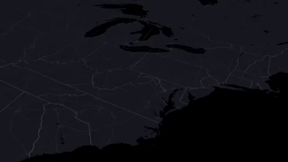

# GeoSpatial

1. [deckgl-point-animation](https://peterbeshai.com/blog/2019-08-10-deckgl-point-animation/)

The author shows how to animate 17,000+ public libraries in the US on maps with deck.gl.

2. [Trase.earth](https://trase.earth/flows)

Trase.earth provides an open-access information platform for tracing the international flow of agricultural commodities. At the heart of Trase is a beautiful, interactive sankey diagram that visualizes the journey soy and beef takes before arriving on your plate. This makes it possible to follow how sourcing patterns and trade flows have evolved over a period. It can help us to explore what factors might be driving those changes and identify new opportunities to improve sustainability.

These data are now available on the Trase data portal free of charge, so researchers and analysts can use for their own work.

# Research

# Videos

# Tool

1. [GeoGebra](https://www.geogebra.org/)

2. [Calculus For The People](https://www.geogebra.org/m/x39ys4d7)

[Standard Ebooks](https://standardebooks.org/)

[video-object-removal](https://github.com/zllrunning/video-object-removal)

Just draw a bounding box and you can remove the object you want to remove. This tool is based on SiamMask and Deep-Video-Inpainting.

[shields](https://github.com/badges/shields)

Concise, consistent, and legible badges in SVG and raster format, which can easily be included in GitHub readmes or any other web page. The service supports dozens of continuous integration services, package registries, distributions, app stores, social networks, code coverage services, and code analysis services.

# Comments
